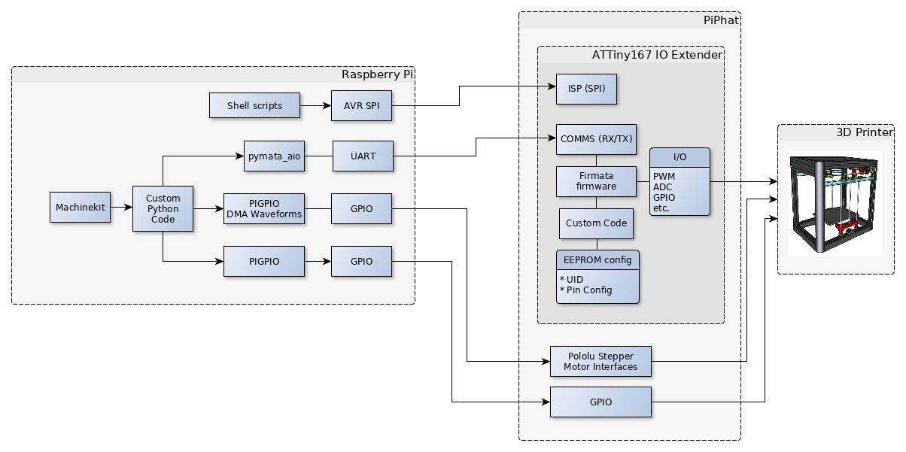
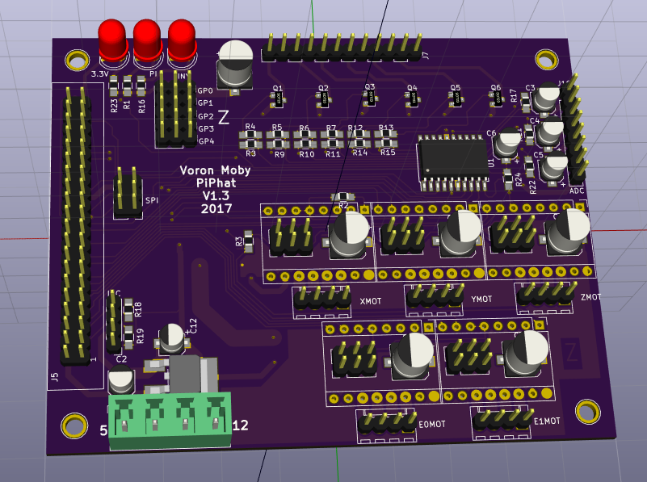

# PiPhat Raspberry Pi to 3D Printer interface

The PiPhat board is designed to perform as a RAMPS style interface between Machinekit and a 3D printer via the 40 pin GPIO connector of a Raspberry Pi. Step generation is not to be provided by the Machinekit software stepgen routines, but rather by a DMA generated waveform. The DMA waveform should provide highly reduced jitter compared to the software stepgen.

## System diagram

### IO processor

Since the Raspberry PI does not have onboard analog to digital converters an IO processor is included on the PiPhat, an AVR ATTINY167. This processor will be loaded with [firmata firmware](https://github.com/firmata/arduino) which provides a serial interface to offload IO from the Raspberry Pi. The AVR EEPROM will store configuration information indicating what IO is available to provide introspection capability to the Raspberry PI. This configuration will require some custom code based on the ideas [here.](https://arduino.stackexchange.com/questions/28971/can-you-save-data-to-eeprom-using-firmata)  Provision for flashing the device is provided by a SPI interface tied to the Raspberry Pi.

### Stepper motor interfaces

Stepper motor drivers are standard [Pololu carriers](https://www.pololu.com/category/120/stepper-motor-drivers) with step/direction inputs. 

### Raspberry Pi IO interfaces

Connection to the Firmata firmware will be provided by [pymata_aio](https://github.com/MrYsLab/pymata-aio/wiki) and the RX/TX UART on the 40 pin header. (Inspired in part by this [thread](https://groups.google.com/forum/#!searchin/machinekit/protobuf|sort:relevance/machinekit/mghEXsQ_s_U/8KuVaWzAzvoJ) from the Machinekit Google group.)

The trajectory planning from Machinekit will be piped to a custom Python module which will generate step waveforms (using a slow loop such as servo, not a fast realtime loop) suitable for consumption by [pigpio.](http://abyz.co.uk/rpi/pigpio/)

Other assorted GPIO from the Raspberry Pi will also be serviced by pigpio routines.

## Prototype Board

A prototype board making all the connections has been designed on [Kicad.](http://kicad-pcb.org/) The version rendered above is on its way from [dirtypcbs.](http://dirtypcbs.com/store/pcbs/about) The intent is to provide design files as open source hardware but this first round is too rough to share.

[ugly schematic](schematic.pdf)

